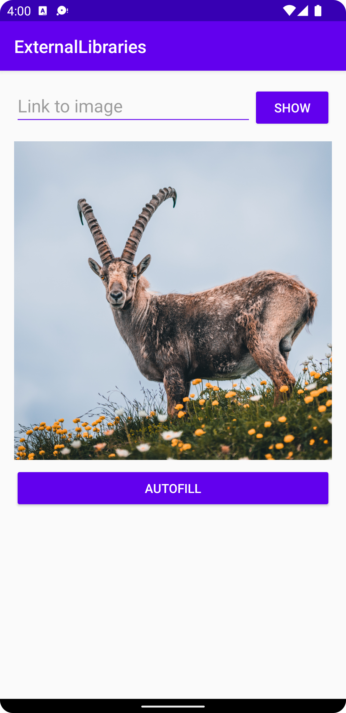

# Report

This application implements [Glide](https://github.com/bumptech/glide), a third-party library for loading and decoding multimedia, such as images or videos. In this case, an image is loaded from an external URL and mounted onto an `ImageView`.

```java
Glide.with(this).load(editText.getText().toString()).into(imageView);
```

Note how **Glide** receives the appropriate context, an external link to the resource, and a reference to the widget where the image should be mounted.

<p align="center">
  
</p>

## Prerequisites

Since the image file is external to the application itself, a request is made to a networked server. Because of that, the application must be permitted to browse the Internet.

### Android Manifest

```xml
<uses-permission android:name="android.permission.INTERNET"/>
```
